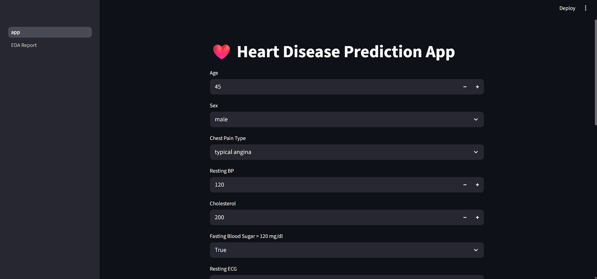
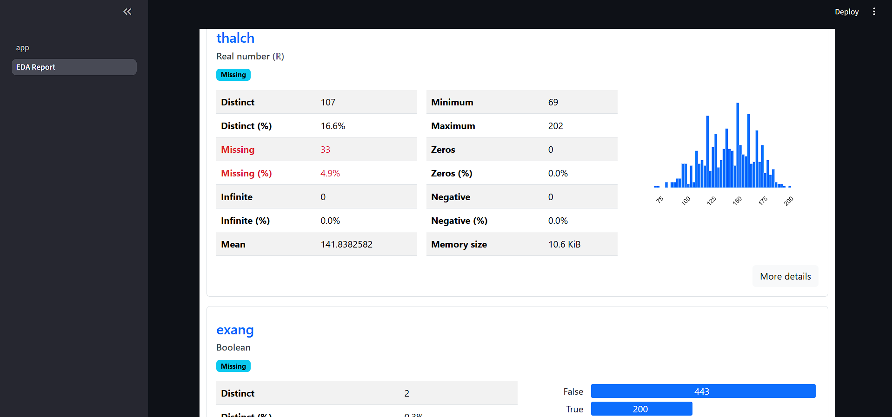

# 🩺 Diabetes Prediction Web App

A simple and interactive **Streamlit** web application that predicts whether a person has diabetes or not using a **Logistic Regression** model. Also includes a dataset **Playground** for Exploratory Data Analysis (EDA) using `ydata-profiling`.

---

## 🎯 Features

- ✅ Predicts diabetes based on user inputs using Logistic Regression
- 📊 Full dataset EDA using YData Profiling (in a separate page)
- 🧪 Integrated with Streamlit's interactive UI
- 🔒 Lightweight and secure deployment using Streamlit Cloud

---

## 🧠 Tech Stack

| Category      | Tech Used             |
|---------------|-----------------------|
| Frontend      | Streamlit             |
| ML Model      | Logistic Regression (scikit-learn) |
| Data Analysis | ydata-profiling       |
| Language      | Python                |
| Deployment    | Streamlit Cloud       |

---

## 🖼 Screenshots

<details>
  <summary>🧾 Prediction Page</summary>

  
  
</details>

<details>
  <summary>📊 EDA with YData Profiling</summary>

  
</details>


---

## ⚙️ Setup Instructions

```bash
# 1. Clone the repo
git clone https://github.com/your-username/diabetes-predictor
cd diabetes-predictor

# 2. Install dependencies
pip install -r requirements.txt

# 3. Run the app
streamlit run app.py
